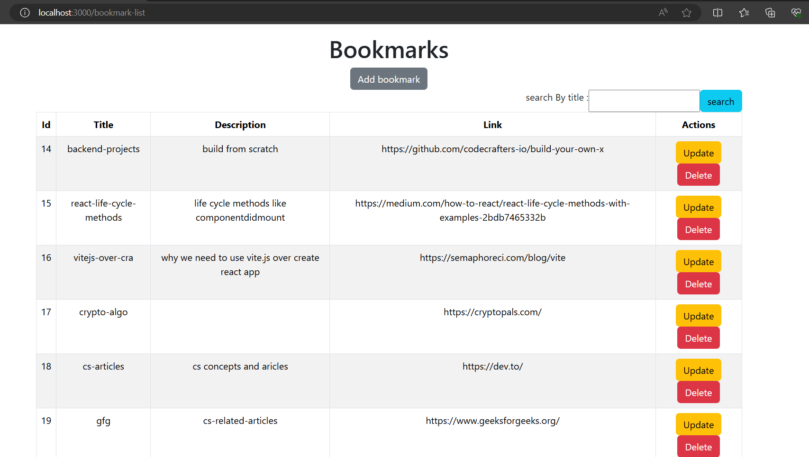

# BOOKMARKS MANAGEMENT SYSTEM

- This is single user or multi-user without privacy

[List of EndPoints](./backend/bookmarks/README.Md "backend readme")

## Here are demo images showing the working of app.

